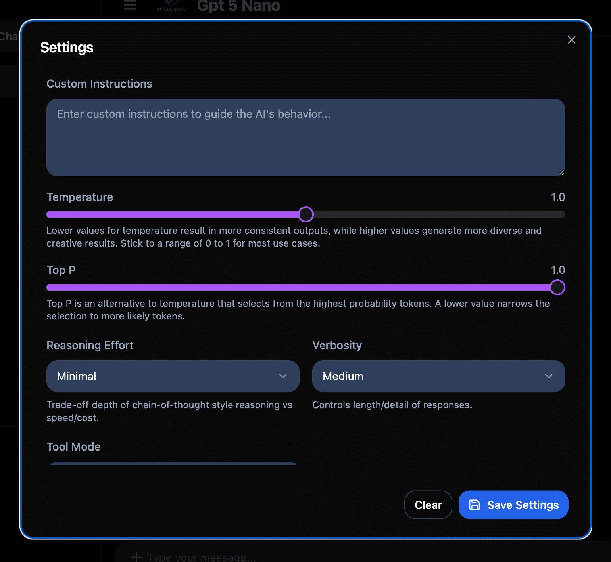
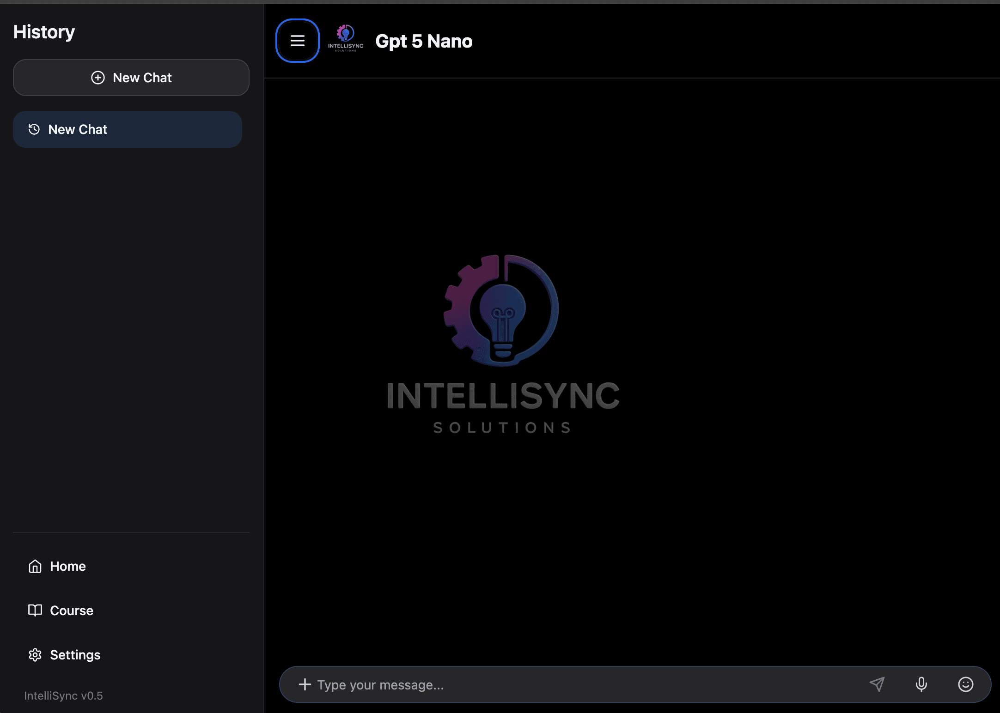
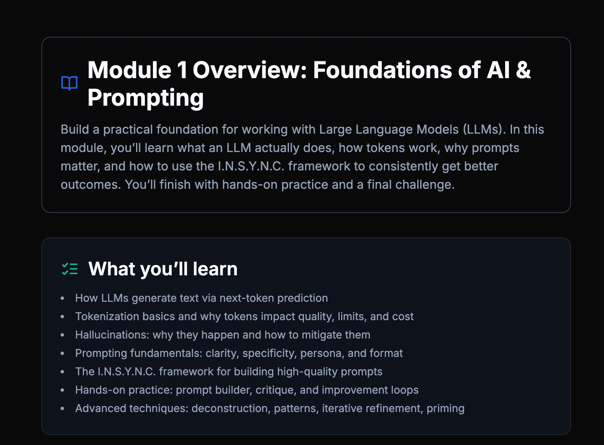
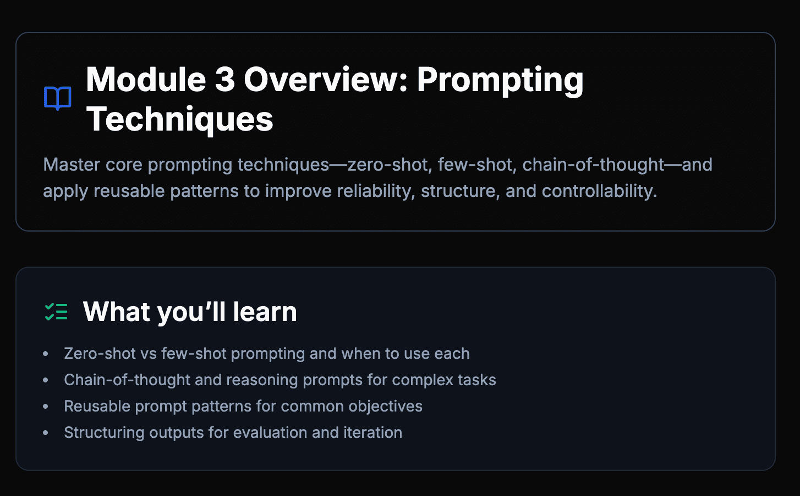
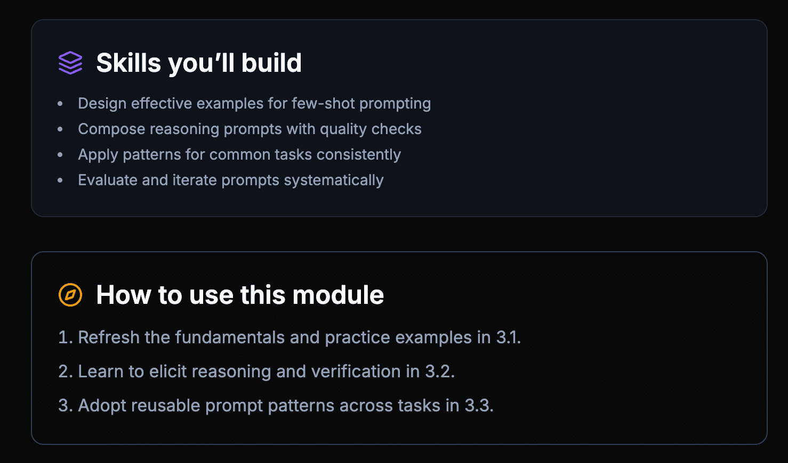
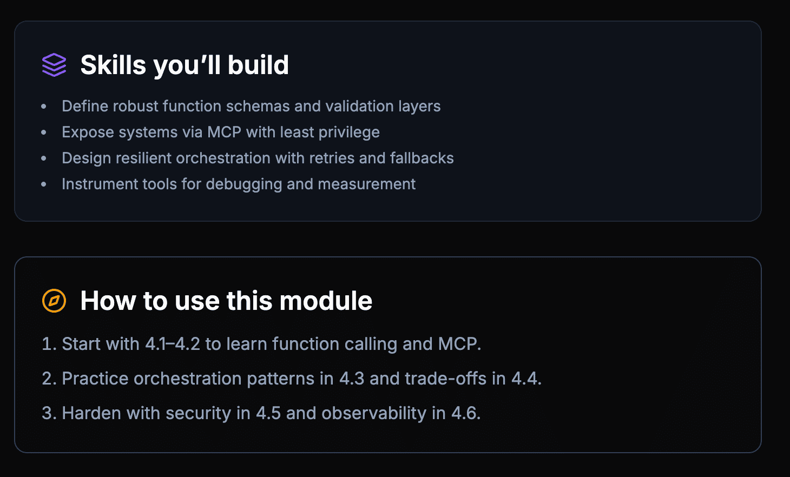
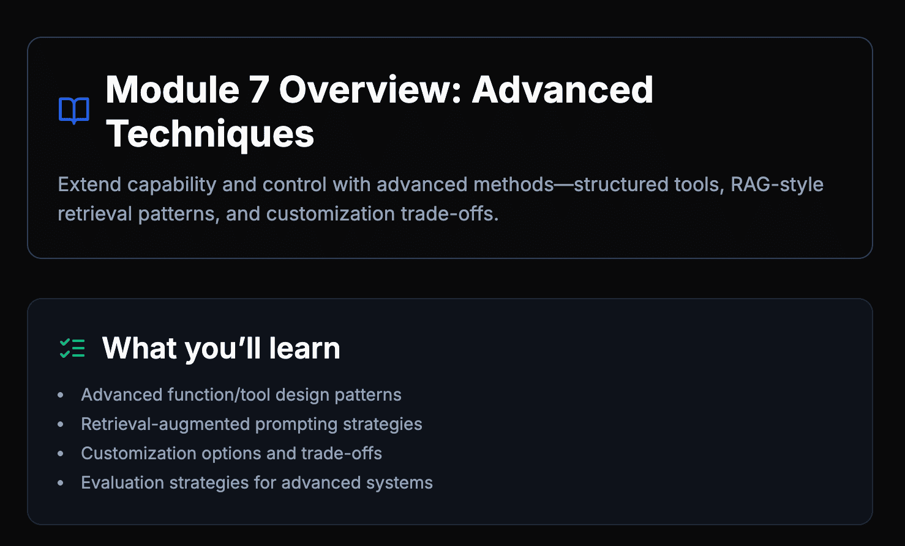
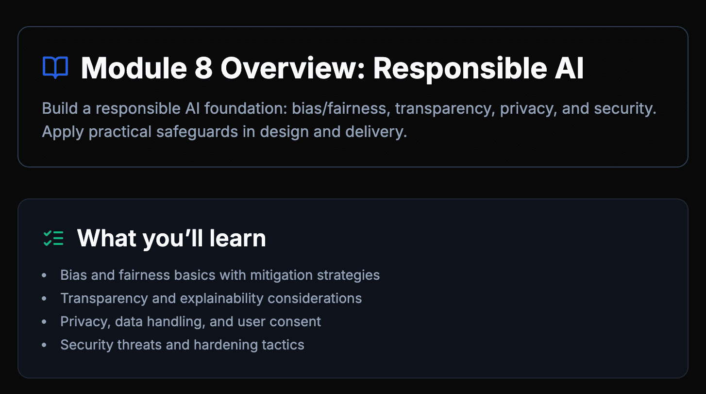
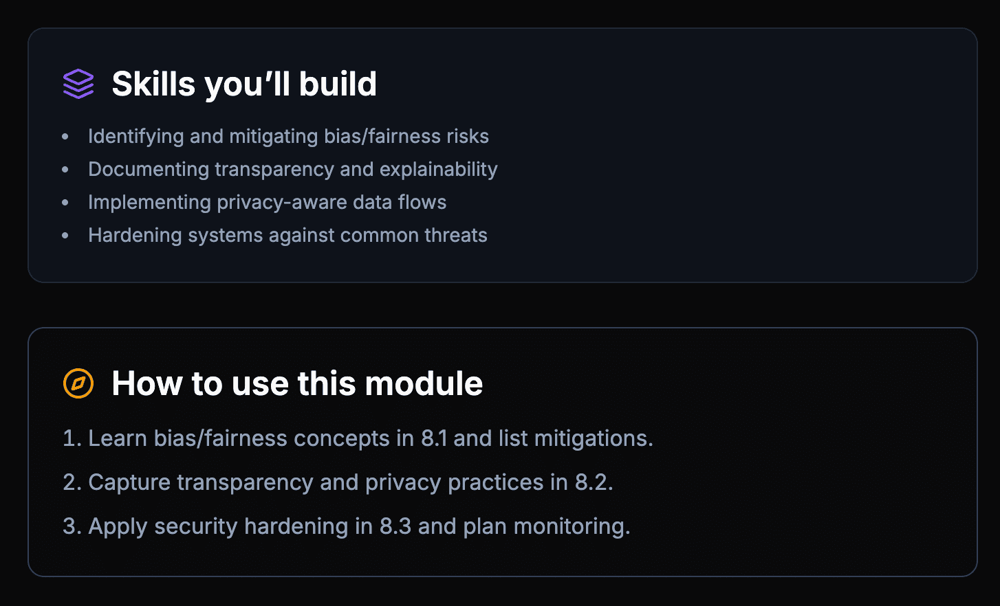

# Chat App Monorepo

This is a monorepo for a chat application, consisting of a web-based frontend and a backend API. This guide will walk you through setting up the project, even if you are new to development.

## 1. What You’re Getting

- A **chat website** (like ChatGPT) that runs locally on your machine.  
- A **private build space** where you can experiment without the whole internet watching.  
- The freedom to **Clone** (make your own copy) and share ideas with friends.

No complex maths, no mysterious jargon—just clear instructions.

## Project Structure

This project is a monorepo managed with pnpm workspaces. The structure is as follows:

```
.
├── apps/
│   ├── api/         # Backend API service
│   └── web/         # Frontend web application
├── packages/        # Shared code between applications
├── .env.example     # Example environment variables
├── package.json     # Root package.json with workspace scripts
└── pnpm-workspace.yaml  # pnpm workspace configuration
```

- `apps/api`: Contains the backend API service.
- `apps/web`: Contains the frontend web application.
- `packages/`: For shared code between applications.

## ChatCourse – Updated Quick Start (2025-08-17)

The repo is a pnpm monorepo with:
- `apps/web` (Vite + React) running on `http://localhost:3001`
- `apps/api` (Express) running on `http://localhost:3000`
- `packages/ui` shared components

## Quick Start
1) Install deps

```bash
pnpm install
```

2) Add environment variables

```bash
cp .env.example .env.local
# edit .env.local and set at least:
# OPENAI_API_KEY=sk-...
```

3) Run both web and API

```bash
pnpm dev
```

- Web: http://localhost:3001
- API: http://localhost:3000

## Scripts (root)
- `pnpm dev` — runs web and api together
- `pnpm build` — builds web and installs api deps
- `pnpm start` — starts the API only
- `pnpm lint`, `pnpm format`

## Environment
- Required: `OPENAI_API_KEY`
- Optional: `OPENAI_ORG_ID`, `OPENAI_MODEL` (e.g., `gpt-5-nano`), `DEFAULT_TEMPERATURE`, `DEFAULT_TOP_P`, `MAX_TOKENS`
- Dev proxy: `apps/web/vite.config.ts` proxies `/api` to `VITE_API_URL` or `http://localhost:3000`
- Production web: `apps/web/.env.production` sets `VITE_API_URL=/api`

## API Endpoints (apps/api/handler.ts)
- POST `/api/chat`
- POST `/api/chat/refine-prompt`
- POST `/api/chat/grade-prompt`
- POST `/api/chat/grade-function-prompt`
- POST `/api/chat/evaluate-challenge`
- POST `/api/chat/evaluate-final-challenge`
- POST `/api/chat/evaluate-summary`
- GET  `/api/chat/get-patterns`

Allowed models: `gpt-5`, `gpt-5-mini`, `gpt-5-nano` (default: `gpt-5-nano`).

## Deployment (Vercel)
- SPA routes to `index.html`
- `/api/*` routed to `apps/api/vercel.ts`

<!-- Editor guidance moved into Section 4 below to keep steps linear for beginners. -->

### OS-specific notes
- macOS/Linux
  - Terminal app: Terminal/iTerm. Shell: zsh/bash.
  - Copy env file: `cp .env.example .env.local`
  - Start both apps: `pnpm dev` (Web: 3001, API: 3000)
- Windows
  - Use PowerShell (or WSL for Unix-like experience).
  - Copy env file: `copy .env.example .env.local`
  - Start both apps: `pnpm dev`
  - If the API dev script errors on `NODE_ENV=development`, run it in PowerShell like:
    ```powershell
    $env:NODE_ENV = "development"
    pnpm --filter @chat/api dev
    ```
    or install a cross-platform env tool (e.g., `cross-env`).

## Screenshots
  
  - Setup
    
    _Caption: After installing tools, your setup screen may look like this._
  
  <!-- Optional: custom sizing example -->
  <!--  -->
   
  —

Legacy beginner-friendly instructions remain below for reference.

## 2. Before You Begin: Tools You’ll Need

| Tool | What it’s for | How to get it |
|------|---------------|---------------|
| **GitHub Account** | Saving and sharing your project. | [Create a free account](https://github.com/signup) if you don’t have one. |
| **Node.js** | The engine that runs the project’s code. | [Download Node.js (LTS)](https://nodejs.org/) and run the installer. |
| **Visual Studio Code (VS Code)** | A friendly text editor to open the project. | [Download VS Code](https://code.visualstudio.com/) and install it. |

*Tip: “Terminal” is just a text window where you can type commands. Don’t panic—we’ll tell you exactly what to type.*


_Caption: The Terminal is a text window where you type the commands we show._

## 3. Get the Project Code

### Option A – The Simple Download

1. Visit the project page and click **“Download ZIP.”**  
   `https://github.com/Chris-June/ChatCourse`
2. Un‑zip the file. You’ll get a folder called **`ChatCourse`**.

### Option B – Use Git (skip if that word means nothing to you)

1. In VS Code choose **Source Control → Clone Repository**.  
2. Paste `git@github.com:Chris-June/ChatCourse.git` when asked.

Either way, remember where you put the folder—you’ll need it soon.

## 4. Open the Project in Your Editor (VS Code or Windsurf)

- **Option A — VS Code (most common)**
  1. Open **VS Code**.
  2. Click **File → Open Folder…** and pick the **`ChatCourse`** folder.
  3. If VS Code asks “**Do you trust the authors?**” click **Yes**.

- **Option B — Windsurf (free, beginner‑friendly AI editor)**
  1. Open **Windsurf**.
  2. Click **Open Folder** and pick the **`ChatCourse`** folder.
  3. Use Windsurf’s built‑in **Terminal** for commands like `pnpm install` and `pnpm dev`.

---

## 5. Install the Project’s Libraries

1. In VS Code choose **Terminal → New Terminal**.  
2. A panel appears at the bottom. Copy‑paste this and press **Enter**:

```bash
pnpm install
```

6. **Open the app** in your browser:
   - Frontend: http://localhost:3001
   - API: http://localhost:3000

## 6. Add Your AI Key

1. Get a free key on the OpenAI website → **[Create API Key](https://platform.openai.com/account/api-keys)**.  
2. Copy the key (looks like `sk-…`).  
3. In VS Code’s terminal, run:

```bash
cp .env.example .env.local
```

4. Open **`.env.local`** (left‑hand file list).  
5. Find `OPENAI_API_KEY=` and paste your key after the `=` sign:  

```
OPENAI_API_KEY=sk-1234567890abcdef
```

Save the file (**⌘S** or **Ctrl+S**).

### Screenshots


_Caption: Add your AI key in the `.env.local` file so the app can talk to OpenAI._



_Caption: Optional advanced options—skip these for now if you like._

## 7. Start Chatting!

Still in the terminal, run:

```bash
pnpm dev
```

- First start takes ~20 seconds.  
- When you see `http://localhost:3001`, **click it** (or paste it in your browser).

### Screenshots


_Caption: The main chat screen. Type a message and press Enter._



_Caption: The sidebar holds settings like model and Custom Instructions._

### Course Module Previews



_Caption: Module 1 — Foundations of AI & Prompting (overview and what you’ll learn)._ 


_Caption: Module 1 — Skills you’ll build and how to use this module._


_Caption: Module 2 — Context Management (overview and what you’ll learn)._ 


_Caption: Module 2 — Skills you’ll build and how to use this module._



_Caption: Module 3 — Prompting Techniques (overview and what you’ll learn)._ 



_Caption: Module 3 — Skills you’ll build and how to use this module._


_Caption: Module 4 — AI Capabilities & Tools (overview and what you’ll learn)._ 



_Caption: Module 4 — Skills you’ll build and how to use this module._


_Caption: Module 5 — Advanced Interactions (overview and what you’ll learn)._ 


_Caption: Module 5 — Skills you’ll build and how to use this module._


_Caption: Module 6 — Development with AI (overview and what you’ll learn)._ 


_Caption: Module 6 — Skills you’ll build and how to use this module._



_Caption: Module 7 — Advanced Techniques (overview and what you’ll learn)._ 


_Caption: Module 7 — Skills you’ll build and how to use this module._



_Caption: Module 8 — Responsible AI (overview and what you’ll learn)._ 



_Caption: Module 8 — Skills you’ll build and how to use this module._

🎉 **That’s it!** Type a message and watch the AI reply.

## Troubleshooting (Common fixes)

- **pnpm: command not found**
  - Open Terminal and run: `npm install -g pnpm`
  - Close and reopen the Terminal, then try `pnpm install` again.

- **App says “Missing API key” or responses don’t work**
  - Make sure you created `.env.local` and added `OPENAI_API_KEY=sk-...`.
  - Save the file, stop the app (Ctrl+C), then run `pnpm dev` again.

- **Port already in use (3000 or 3001)**
  - Close other running apps or restart your computer.
  - Then run `pnpm dev` again.

- **Windows: errors with NODE_ENV**
  - Use PowerShell and set: `$env:NODE_ENV = "development"` then run `pnpm --filter @chat/api dev`.

- **Network/CORS or “fetch failed” in the browser**
  - Make sure the API is running (Terminal shows localhost:3000) and the web app is running (localhost:3001).
  - If issues persist, stop both (Ctrl+C) and start again with `pnpm dev`.

## 8. What’s Next?

| Want to… | Do this |
|----------|---------|
| **Change the AI’s personality** | Open `apps/api/handler.ts`, scroll to the *System Prompt* near the end, and rewrite the text inside quotes. |
| **Tweak responses (tone, format)** | In the chat site, click **Settings → Custom Instructions**. |
| **Invite friends to play** | Send them this README. |
| **Learn the techy stuff** | Expand the **Advanced Section** below (totally optional). |

## 9. Glossary (Plain‑English)

| Term | Simple meaning |
|------|----------------|
| **AI** | Software that predicts text responses. |
| **API key** | Secret password that lets your app talk to OpenAI. |
| **Terminal / Command Prompt** | A text box for giving your computer instructions. |
| **Install** | Put new software on your computer. |
| **pnpm install** | Download all the pieces the project needs. |
| **Localhost** | Fancy word for “my own computer.” |
| **Fork** | Make your own copy of someone’s project on GitHub. |

---

## 10. Advanced Section (Developers & Curious Cats)
  
  For rubric-based audits of the learning modules, see `Discovery.md` (Modules 1–8 quality reviews).

<details>
<summary>Advanced (Developers & Curious Cats)</summary>

### `apps/web`

This is the frontend application built with React (Vite). It provides the user interface for the chat application.

### `api`

This is the backend API that handles the chat logic, interacting with the OpenAI API. It is a Node.js service, l a serverless function, as identified by the `handler.ts` file.

## Contributing

Contributions are welcome! This is an open-source project, and I welcome any contributions you may have. For creating your very own version of this project, please follow the instructions in this `README.md` file.

### System Prompt

The system prompt is stored in the `api` package in the `handler.ts` file. You can modify it there. The "System Prompt" is the place to set the AI model overall behavior and gives the user control over the AI model. You can test this by making small modification to the existing system prompt and then running the application. 

Current system prompt can be found in `apps/api/handler.ts`:

```
You are Intelli-Chat, a helpful and friendly AI assistant. Your responses should be concise, informative, and aim to assist the user with their requests.
```

### Custom Instructions

Custom Instructions let you define a **standing system prompt** that is automatically injected into every new conversation. They’re split into two persistent fields:

| Field | Purpose | Typical content |
|-------|---------|-----------------|
| **What would you like your AI model to know about you?** | this gives the AI model context that rarely changes. | Name, role, current projects, brand voice, recurring goals |
| **How would you like your AI model to respond?** | this gives the AI model constraints on:
- style, 
- tone, 
- format, 
- depth, 
- length, etc. | “Answer like a serious friend, keep humour subtle, prefer bullet lists, cite sources.” |

Because these 2 Prompts *System Prompt and Custom Instructions* sit high in the prompt stack (right after the platform’s own system prompts), they influence every reply unless you override them later.

### Prompt Stack Order

1. OpenAI policy / safety prompt  **Cannot be modified or changed**
2. Default model persona / System Prompt **Can be modified or changed in the code `handler.ts`file**
3. **Your Custom Instructions** Can be found in the User Interface **Settings > Custom Instructions** and Can be modified or changed.
4. Any stored Memories  **Not yet implemented**
5. Conversation history  **Conversation history uses local storage (your browser) if your clear your browser data the conversation history will be lost** Data persistence is not yet implemented and will be added in the future learning by integration with a database or cloud storage using Supabase (Free) or antoher Data Base and Vector DB (Qdrant). 
6. Your latest user message  

### Practical Effects

| Influence | Mechanics | Result |
|-----------|-----------|--------|
| **Conditioning** | The model is conditioned on the text, raising the probability of tokens that match your requested style and lowering conflicting ones. | Responses automatically match your preferred tone and format. |
| **Constraint satisfaction** | Instruction‑tuning makes the model favour higher‑level directives. | You don’t have to repeat formatting or persona instructions every time. |
| **Long‑term consistency** | Custom Instructions persist across sessions. | Every new chat starts “in character.” |
| **Token cost** | Custom Instructions counts toward the context window. | Extremely long Custom Instructions reduces space for conversation. |
| **Conflict resolution** | Newer Custom Instructions override older ones (except safety). | You can change tone mid‑chat by giving a new explicit instruction. |

### Crafting Effective Custom Instructions

1. **Be concise** – aim for ≤ 150 words per field.  
2. **Separate facts from style** – keep stable info in the first field, presentation rules in the second.  
3. **Avoid contradictions** – e.g., don’t ask for both “terse” and “500‑word minimum.”  
4. **Use clear imperatives** – “Use APA citations” works better than polite requests.  
5. **Iterate** – tweak wording if the assistant drifts from the desired behaviour.  

> **Tip:** Custom Instructions can’t override platform policy. Requests that violate policy will still be blocked regardless of your instructions.

### Changing Models

Models can be changed in the UI by modifying the selected model from the drop down list. 

The `ALLOWED_MODELS` environment variable in the `.env.local` file can be used to limit the models that are available in the UI. 

The `DEFAULT_MODEL` environment variable in the `.env.local` file can be used to set the default model.

</details>

## License

MIT — do whatever you like, just keep this notice.

---
**Need help?** Open an [issue](https://github.com/Chris-June/ChatCourse/issues) or say hi in the community Discord. Everyone started somewhere. 🙌